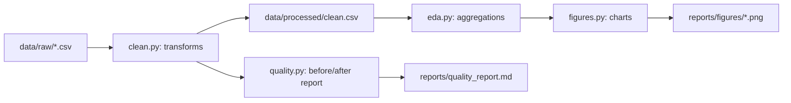

# messy-data-eda

> Messy real-world e-commerce sales data: cleaning pipeline, EDA, documented decisions and a data dictionary.

[](https://github.com/Prithv122/messy-data-eda/actions/workflows/ci.yml)

**Live demo:** not deployed — runs locally (`uv run messy-data-eda`)
**Stack:** pandas, matplotlib, seaborn, pytest, ruff, uv

---

## 1. The problem

Raw exports from production systems are never analysis-ready: inconsistent formats, ambiguous
missing values, duplicate records. Before any dashboard, model, or business report can be
trusted, someone has to turn that export into a dataset whose every column has a known,
defensible meaning — and be able to say *why* each fix was made, not just that "the data was
cleaned." This project is that case study: profile a real messy export, decide a rule for each
problem with evidence (not a blanket "fill everything, drop everything"), and show whether the
cleaning actually changed any business conclusion.

## 2. The data

| | |
|---|---|
| Source | [Messy E-Commerce Sales Dataset 2026](https://www.kaggle.com/datasets/afaqkhan091/messy-e-commerce-sales-dataset-2026) by AfaqKhan, Kaggle |
| Size | 12,180 rows × 13 columns, 1.2 MB |
| Licence | CC0 (public domain) |
| Refresh | One-off (static export) |

**This dataset is synthetic**, generated to simulate a raw production export with realistic
data-quality issues — not real customer transactions. The dataset author states this plainly,
and so do we: every number below is real (computed from the actual file in this repo), but the
underlying orders never happened. See `NOTES.md` for why this dataset was chosen over two real
alternatives (one had an unresolved license, the other is one of the most reused datasets on
Kaggle and reads as a tutorial retread).

## 3. Architecture



One command (`uv run messy-data-eda`) runs the whole left-to-right path: load → clean →
report → analyze → chart. No database, no service — a script-and-CSV pipeline is the right
tool for a one-off dataset this size.

## 4. Key decisions & tradeoffs

| Decision | Chose | Over | Why |
|---|---|---|---|
| Missing-value handling | Per-column rule backed by a measured pattern (flag, fill sentinel, or leave as real NaN) | Blanket imputation (fill everything) or blanket row-drop | `Discount_Percent`'s 0.0 is already a common explicit value (4,099 rows) — imputing missing as 0 would erase the distinction between "confirmed no discount" and "unknown." `Customer_Rating` is missing for 100% of non-delivered orders — that's not a defect, it's an order that was never delivered. Imputing either would fabricate information that doesn't exist. |
| Invalid quantity (≤0, 192 rows) | Flag + exclude from quantity/revenue aggregates, keep the row | Delete the row | Checked whether invalid quantities cluster in Returned/Cancelled orders (would suggest a real "return credit" signal) — they don't; they're proportionally spread across every `Order_Status`, so it's a data-entry error. Deleting the row would also throw away otherwise-valid category/payment/country data for that order. |
| Duplicate detection | Exact full-row match only | Fuzzy/partial matching on `Order_ID` | Verified first: every duplicated `Order_ID` (180 of them) has exactly one full-row twin with zero conflicting values — `12,180 - 180 = 12,000`, which is exactly `Order_ID.nunique()`. A blind fuzzy-match approach would have been solving a problem that isn't there. |
| Date parsing | A 5-pattern regex dispatcher, each pattern verified unambiguous before trusting it | `pandas.to_datetime(..., infer_datetime_format=True)` | The two slash/dash date groups are genuinely ambiguous as bare formats (`MM-DD-YYYY` vs `DD-MM-YYYY`, `DD/MM/YYYY` vs `MM/DD/YYYY`). Checked the day-segment values directly: the dash group never has a day >12 in the *first* slot and the slash group never has a day >12 in the *second* slot, so each format is consistent throughout the file. Guessing per-row with a generic parser risks silently swapping day/month for the ambiguous rows. |

## 5. Results

| Metric | Value | Notes |
|---|---|---|
| Raw rows | 12,180 | — |
| Exact duplicates removed | 180 | `12,180 → 12,000` unique orders |
| Invalid quantity flagged | 192 (1.6%) | 101 at `-1`, 91 at `0` |
| Discount missing, flagged | 735 (6.0%) | Not imputed — see Key Decisions |
| Shipping city missing, filled `"Unknown"` | 502 (4.1%) | — |
| Rating missing (legitimate) | 6,150 (50.5%) | 100% of non-delivered orders + 9.6% of delivered orders |
| Top category by revenue | Electronics — $404,823 gross | Invalid-quantity rows excluded |
| Order status funnel | 54.8% Delivered / 26.8% in progress / 18.4% lost | See `reports/figures/order_status_funnel.png` |
| **Did cleaning change a conclusion?** | **Yes** | Naively grouping the *raw* `Payment_Method` column, the top spelling is `"paypal"` (709 orders). After standardizing casing/format, the true top method is **Cash on Delivery (2,070 orders)** — a materially different, and correct, answer. See `reports/figures/payment_method_before_after.png`. |

Every number above is reproduced live by `uv run messy-data-eda` against the committed raw
CSV — nothing here is hand-typed from a one-off notebook run.

## 6. How to run

```bash
git clone https://github.com/Prithv122/messy-data-eda.git
cd messy-data-eda
uv sync
uv run pytest --cov=src --cov-report=term-missing
uv run messy-data-eda
```

No environment variables, no external services, no dataset download required — the raw CSV
is committed at `data/raw/ecommerce_retail_transactions_raw.csv` (CC0). Cleaned output lands
at `data/processed/clean.csv` (regenerated, not committed); the quality report and all four
figures land in `reports/`.

## 7. What I'd change at 100× scale

At ~1.2M rows this still fits comfortably in memory as pandas, but the per-row Python loop in
`parse_order_date` (needed because the five date formats require pattern *dispatch*, not a
single `strftime`) would become the real bottleneck — I'd vectorize it by classifying rows
into format-groups first (a single `str.contains`/regex pass per pattern) and parsing each
group in one `pd.to_datetime` call instead of looping row by row. I'd also move the raw file
out of git (CC0 or not, a multi-GB file doesn't belong in a repo) and into object storage,
with the pipeline reading from there and the quality report becoming a scheduled job that
alerts if the shape of a problem changes — e.g. if invalid-quantity rows suddenly *do* start
clustering by `Order_Status`, the "data-entry error, not a signal" conclusion in this README
would need to be revisited, not assumed forever.

---

## References

None consulted beyond the dataset's own Kaggle page — the cleaning rules and EDA approach
here are original to this project.
